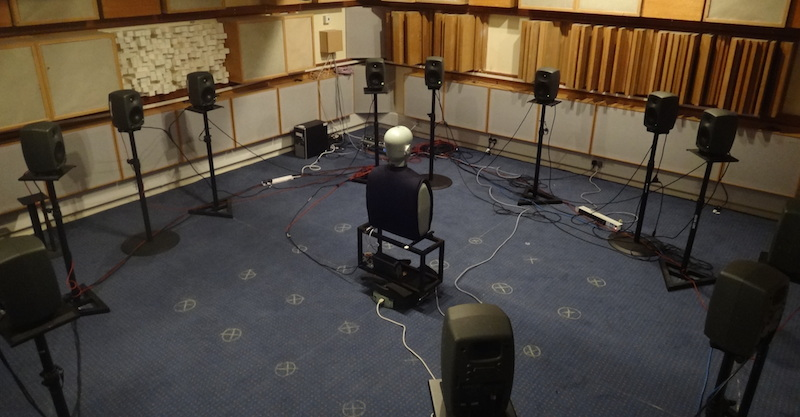

SSR Scenes from BBC R&D
======================

Scenes for the BRS renderer using BRIRs from the ITU-R BS.1116 compliant listening room at the Acoustics Research Centre of the University of Salford.

These BRIR measurements are examples taken from the Salford-BBC Spatially-sampled Binaural Room Impulse Response (SBSBRIR) dataset.

Scenes are available for the central listening position (0,0)m and one off-centre listening position (0.5,-0.5)m within the loudspeaker array.

See http://www.bbc.co.uk/rd/publications/sbsbrir for the full dataset, with measurements at 15 listening positions.

License: Creative Commons Attribution-NonCommercial-ShareAlike 4.0
http://creativecommons.org/licenses/by-nc-sa/4.0/

